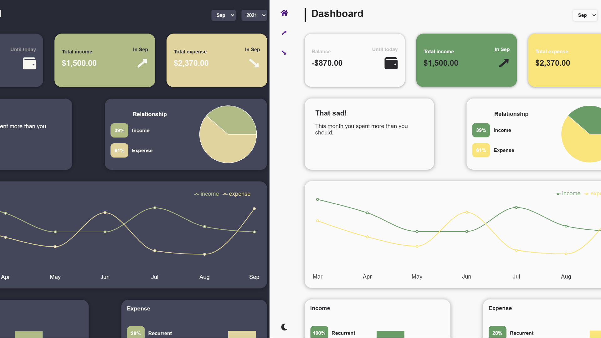

 

  <h3 align="center">My wallet</h3>

  

    Dashboard para gestão de finanças pessoais.
  

  
Índice

  <ol>
    <li>
      <a href="#sobre-o-projeto">Sobre o projeto</a>
      <ul>
        <li><a href="#construido-com">Construido com</a></li>
      </ul>
    </li>
    <li><a href="#contato">Contato</a></li>
  </ol>

## Sobre o projeto

 
Esse dashboard gerencia os ganhos e gastos do cliente, mostra os dados de forma simples através de gráficos.

 
Por enquanto não há banco de dados, os dados são carregados de 1 arquivo que contém arrays simulando os repositórios de dados.

 

[Link demo](https://james-mywallet.netlify.app/).

### Construído com

O projeto foi construído utilizando

- [Reactjs](https://reactjs.org)
- [TypeScript](https://www.typescriptlang.org)
- [Material-UI](https://material-ui.com)
- [Recharts](https://recharts.org/?p=/en-US)

## Contato

William James - william.james.pj@gmail.com

Link do projeto: [https://github.com/william-james-pj/mywallet](https://github.com/william-james-pj/mywallet)
